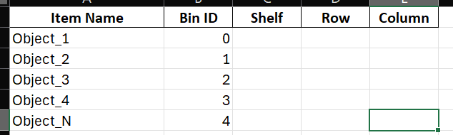
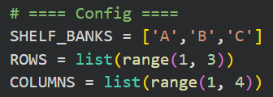
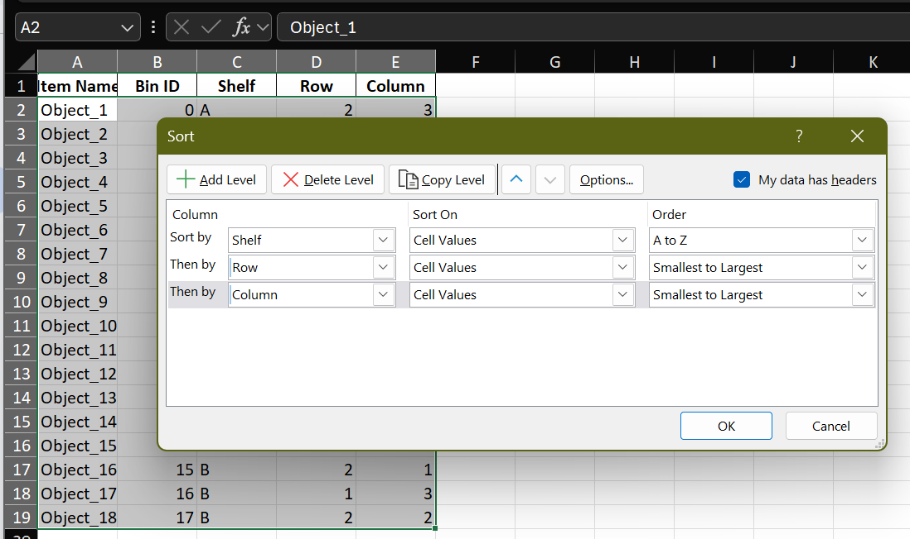
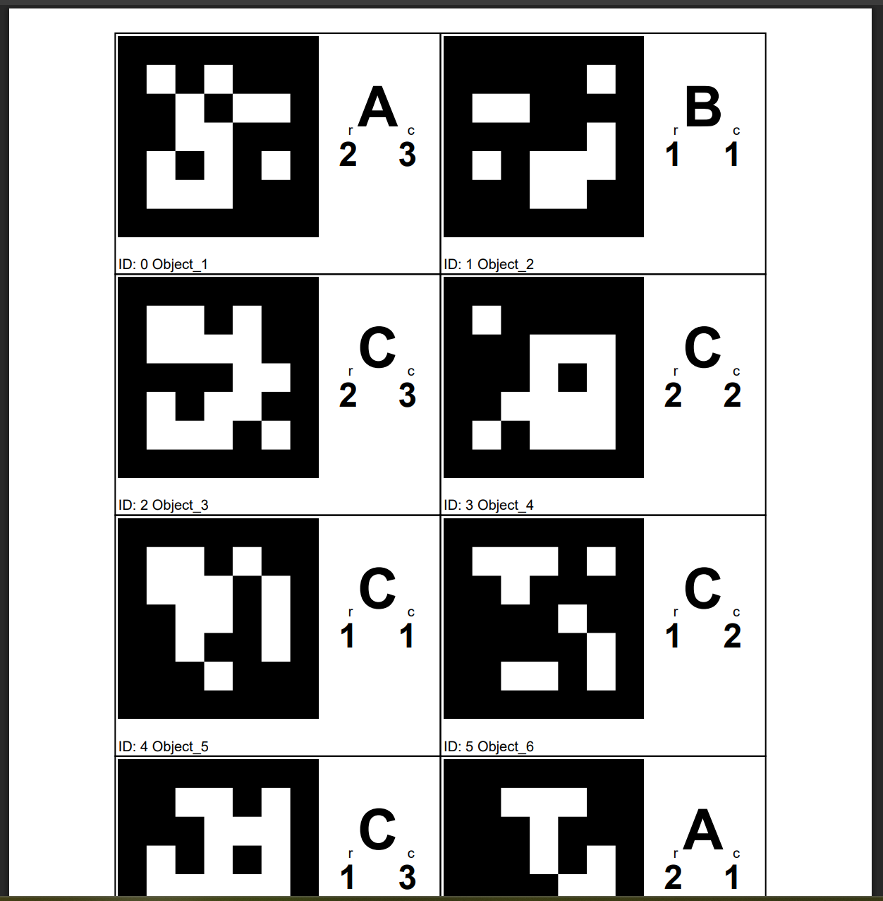
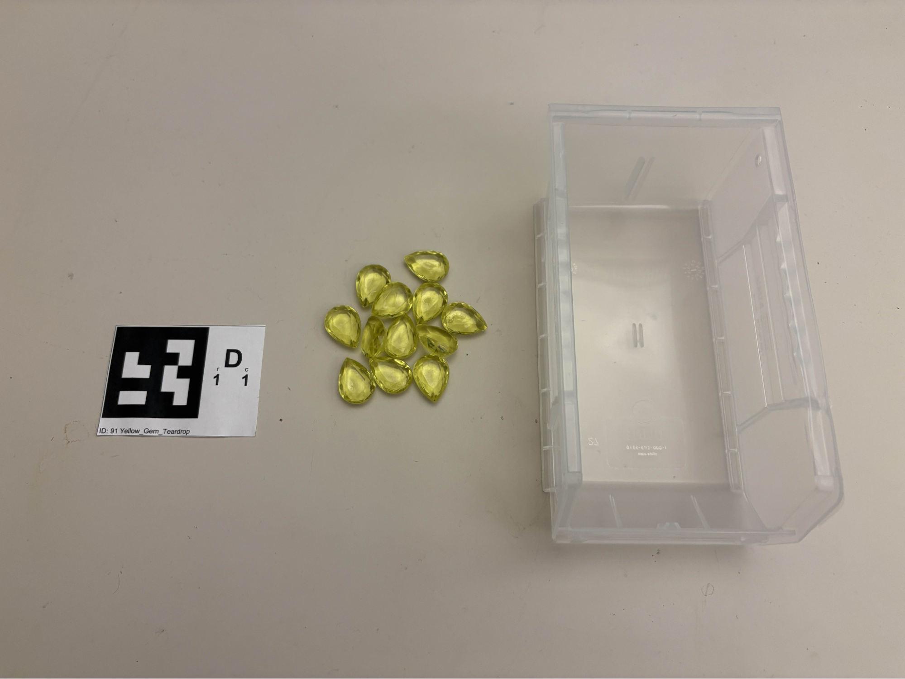
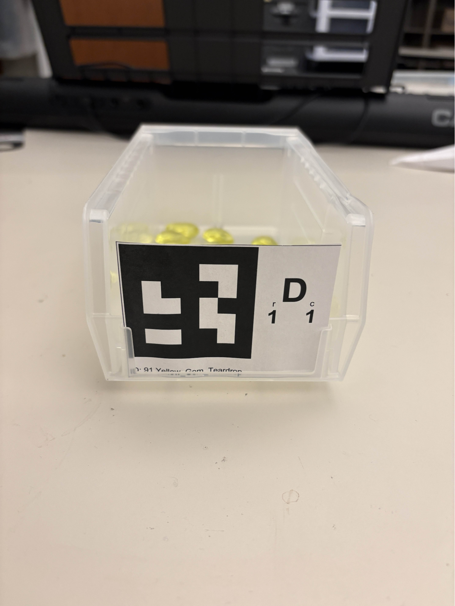
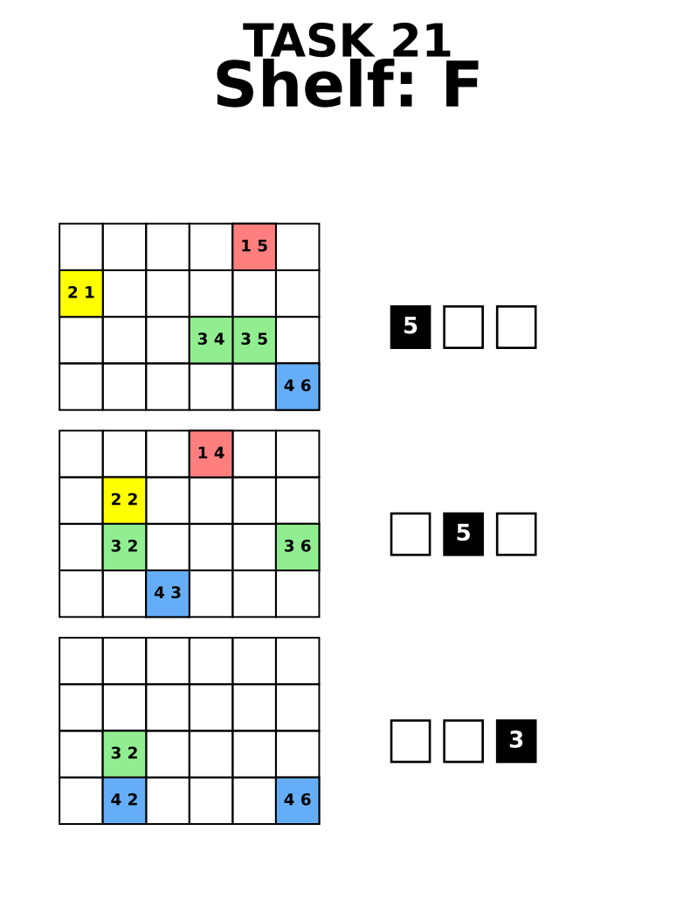
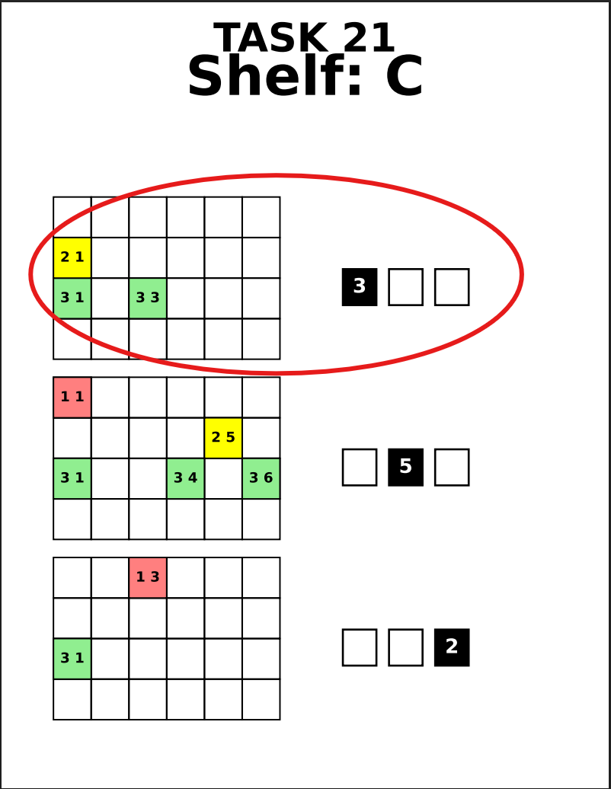
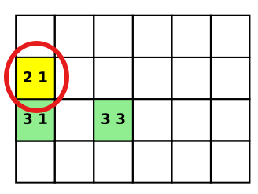

# Symbiotic AI: Lab Environment Setup

## Preface
The following document will walk you through setting up the lab environment used in this Symbiotic AI project. Please note that this exact lab environment is not required for the project, and similar objects/setup can be used to fit your specific application.

---

## Curating a Dataset

You can use any assortment of distinct, unique objects to curate the dataset. Our dataset consisted of **120 unique objects**. The Excel Spreadsheet for the dataset is included in this repo as `Randomized_Objects_List.xlsx`. You can find links to most of the objects (or substitutes) in Appendix 1.

In particular, we chose objects that were challenging for computer vision models to recognize, which includes:

- **Acrylic Gems**: Complex facets and transparent material make their appearance change as the light shifts.
- **Foam Letters**: Similarly-colored/textured objects with differing distinct shapes that could be interpreted differently depending on orientation.
- **Plastic Tableware**: Similarly-shaped (yet not identical) objects with distinct colors.

Other objects that we haven’t tested, but would *(probably)* make good objects for the dataset could be:

- **Lego Bricks**: The sheer variety of pieces allows for objects that have similar shapes with different colors, and similar colors with different shapes.
- **Nuts/Bolts/Screws**: Similar shapes and colors that differ only in length or size.

⚠️ **Important:** Make sure you have **at least three copies of each object**. With the way picklists are generated, each object has the potential to be selected up to three times per task.

---

## Creating the Dataset

Our project implementation uses **120 unique objects randomly divided amongst five banks of shelves**.

1. Create a new Excel Spreadsheet.
2. At the top, enter the following column names:
   
- Item Name  
- Bin ID  
- Shelf  
- Row  
- Column  

3. For each of your unique items, enter its name and Bin ID.  
   Do **not** enter anything into Shelf, Row, or Column yet.

   

5. Use the **Rack Randomizer (Colab or Python Script)** to assign positions.

⚠️ **Make sure to adjust parameters to match your lab setup.**

Example configuration:

- 3 shelf banks
- Shelf Labels: A,B,C
- 2 shelves (rows) per shelf bank
- Each shelf can hold 3 bins (columns)

5. Sort the spreadsheet by:
   - Shelf → Row → Column

Your Excel spreadsheet is now ready to use.

---

## Creating the ArUco Markers

Once you have your Excel spreadsheet, you can use the **Aruco Maker (Colab or Python Script)** to automatically generate markers.

You will also need markers:
- **990**
- **991**
- **992**

These are used for output bins.
You can use this online website to generate all three of them on the same piece of paper:
https://fodi.github.io/arucosheetgen/

---

## Setting up the Lab Environment

### You will need:

- **Bins to hold your dataset objects**  
  We recommend these bins from Uline:  
  https://www.uline.com/BL_305/Uline-Plastic-Stackable-Bins  
  + **3 additional bins** for the output.

- **Shelves to hold your bins**  
  Our dataset used **five banks of shelves**, with **four shelves each**, where each shelf could hold **six bins side-by-side** for a total of **120 unique objects**.

- **An additional shelf or surface for your Output Bins**

- **Your dataset objects**

- **Your ArUco Markers**, plus markers **990, 991, and 992**
---

### 1. Label Shelves

Clearly label each shelf with a letter and use colored tape.

---

### 2. Prepare Bins

Gather:
- Objects
- Corresponding marker
- One bin

---

### 3. Attach Marker

Place objects in the bin and attach the marker so it stands upright.

> 💡 Tip: Tape it to cardboard if needed to prevent sagging.

---

### 4. Place Bins

Place bins according to their **(row, column)** location.

---

### 5–6. Fill Shelves

Repeat for all bins and shelves.

---

### 7. Output Bins

Place three bins side-by-side and label them with the three 99X Aruco Markers, from left to right.

---

## Generating Tasks

Use the **Picklist Generator Notebook/Script**.

- Input: Randomized dataset  
- Output: Task PDFs  

Each task contains **one sub-task per shelf**.
For example, since our lab setup has **5 shelves**, each task contains **5 sub-tasks**, or **5 pieces of paper.**

---

## Collecting the Data

### Equipment
- Head-mounted, egocentric action camera
- Set up shelves
- Set up output bins

### Process

1. **Mount the camera**
   - Camera hardware used: **Gopro Hero 13 Black**
   - Lens attachment: **Ultra-wide Lens**
   - Digital Lens: **Ultra-Wide**
   - Framerate: **1x 30FPS**
   - Framing: **Widescreen**
   - **Horizon Leveling Off**

   Mount the camera to a head-strapped apparatus. Angle the camera down such that your hands are visible.
   
2. **Start recording**
   For convenience, you can use the **Voice-activated start/stop function** included with the GoPro.
   If you don't have the voice-activated function, you can also use the GoPro app if the camera you have is compatible.
   Otherwise, the camera should have a physical start/stop button you can just reach up and press.
   
4. **Follow task sheet**
   - Start with the first grid
     
     
   - Select **one** object from the grid
     
     
     
   - Reach into the corresponding bin and pick **one** object from the bin
   - Carry the object **in your open palm** to the output bin
   - Place the object into the output bin
   - **Repeat with all objects in the selected grid**
   - **Repeat with all grids**
   - **Repeat with all task sheets**

---

## Resetting

After each task, return all items from output bins. The Aruco Markers have the name of the objects printed on them for easy resetting.

---

## Appendix 1: Dataset Objects

Please note that any assortment of unique objects should suffice.  
However, for **full reproducibility**, the following is the exact dataset (or closest available equivalents) used in this project.

Some objects are no longer available and may need substitutes.

---

### 🧪 Objects Used

- **Acrylic Gems**  
  https://a.co/d/0iq4STys  

- **Colored Paperclips**  
  https://a.co/d/0iq4STys  

- **IKEA PRIDLIG Owl/Leaf Clips**  
  *No longer sold in stores.*  
  Replace with **9 unique object types** of similar size/shape.

---

### 🔤 Foam Letters  
https://www.target.com/p/munchkin-bath-letters-and-numbers-36ct-bath-toy-set/-/A-14026155  

- Each set contains **26 unique letters**
- You will need **at least 3 sets**

---

### 🍴 IKEA KALAS Flatware Set  
https://www.ikea.com/us/en/p/kalas-18-piece-flatware-set-mixed-colors-seasonal-edition-30620094/

- Each set contains:
  - 1 fork, knife, and spoon  
  - In each of 6 colors  
- You will need **at least 3 sets**

---

### 📎 Clips & Small Objects

- **IKEA BEVARA Plastic Sealing Clips** (similar item)  
  https://a.co/d/0gydRNhG  

- **Alligator Clips**  
  https://a.co/d/0iNJln7d  

- **Clothespins**  
  https://a.co/d/06u5WJJU  

---

### 🟦 Tiles & Shapes

- **Clear Acrylic Circular Tiles**  
  https://a.co/d/02pwj52M  

- **Red Square Tiles** (the ones we used were laser cut from acrylic, but these foam ones should be sufficient. If you want to use the other colors, make them their own separate item.)  
  https://a.co/d/0gAE6ubt  

- **Wooden Tiles**  
  https://a.co/d/0dLYki0V  

---

### 🕯️ Miscellaneous

- **Candles**  
  https://a.co/d/013cMZ4N  

- **Black Casing**  
  *Unknown origin — replace with any 1 unique object type*

- **Blue Casing**  
  *Unknown origin — replace with any 1 unique object type*

---

### 🔵 Beads / Spheres

- **Wooden Beads** (original unknown source)  
  Replace with:
  - Larger marbles: https://a.co/d/04yI2Qqw  
  - Smaller marbles: https://a.co/d/0e0Ahyme  

---

## 💡 Notes on Substitution

- Substitutions are **completely acceptable**, but:
  - Try to maintain **visual ambiguity** (similar shapes/colors)
  - Avoid objects that are **too easy to distinguish**
- The goal is to create a dataset that is **challenging for computer vision models**
